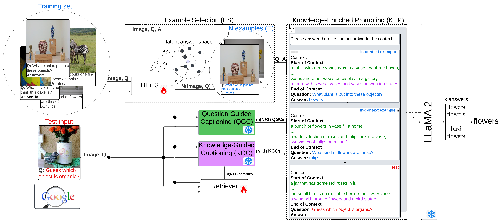

# Knowledge-Integrated-Reasoning-VQA




## Install

First, install the necessary dependencies:

```bash
pip install -r requirements.txt
```

---

### **Run the Code**
Before running the code, you need to **download the LLaMA weights** and convert them to the **Hugging Face Transformers format**

To run the model, use the **`run_main.sh`** script:

```bash
python main.py \
    --dataset ok_vqa \
    --evaluation_set val \
    --train_annotations_path annotations/ok_vqa/train_annots_fixed.csv.zip \
    --val_annotations_path annotations/ok_vqa/val_annots_fixed.csv.zip \
    --test_annotations_path None \
    --train_images_dir /datasets/coco2014/train2014/ \
    --val_images_dir /datasets/coco2014/val2014/ \
    --test_images_dir None \
    --n_shots 10 \
    --k_ensemble 5 \
    --no_of_captions 9 \
    --examples_path Knowledge-Integrated-Reasoning-VQA/beit3_examples/ok_vqa/examples.json \
    --llama_path meta-llama/Llama-2-13b-hf \
    --train_captions_path question_related_captions/ok_vqa/train_data_qr_captions_csv \
    --val_captions_path question_related_captions/ok_vqa/val_data_qr_captions_csv \
    --test_captions_path None \
    --blip_train_question_embedds_path blip_embedds/ok_vqa/blip_normalized_q_embedds/blip_train_question_embedds.csv.zip \
    --blip_train_image_embedds_path blip_embedds/ok_vqa/blip_normalized_i_embedds/blip_train_image_embedds.csv.zip \
    --blip_val_question_embedds_path blip_embedds/ok_vqa/blip_normalized_q_embedds/blip_val_question_embedds.csv.zip \
    --blip_val_image_embedds_path blip_embedds/ok_vqa/blip_normalized_i_embedds/blip_val_image_embedds.csv.zip \
    --path_to_save_preds results/okvqa_val.csv
```

---

## 📌 Notes
- Ensure you replace `/path_to_the_train_images/` and `/path_to_the_val_images/` with the actual paths to your dataset images.
- The LLaMA model should be placed in the `meta-llama/Llama-2-13b-hf` directory.

## 🙌 Thanks & Acknowledgments
The code in this repository is based on **[Simple](https://github.com/alexandrosXe/A-Simple-Baseline-For-Knowledge-Based-VQA)**, and we extended it by fine-tuning a **retriever** to improve the knowledge retrieval process. The retrieved knowledge was then incorporated into **caption generation**. Additionally, we **fine-tuned BEiT-3** for **in-context example selection**.  

Many thanks to the authors for making their code publicly available.

